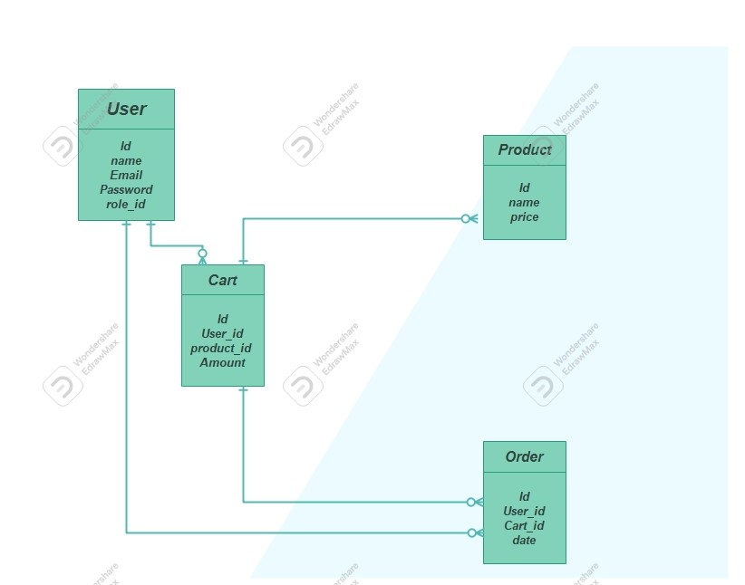

# API Requirements

The company stakeholders want to create an online storefront to showcase their great product ideas. Users need to be able to browse an index of all products, see the specifics of a single product, and add products to an order that they can view in a cart page. You have been tasked with building the API that will support this application, and your coworker is building the frontend.

These are the notes from a meeting with the frontend developer that describe what endpoints the API needs to supply, as well as data shapes the frontend and backend have agreed meet the requirements of the application.

## API Endpoints

#### Products

- getAllProducts (GET /api/v1/products )
- getSpecificProduct (GET /api/v1/products:id )
- delete SpecificProduct (Delete /api/v1/products:id ) (This is only available for registered users as admin)
- create new Product (POSR /api/v1/products ) (This is only available for registered users as admin)
  Show (GET /api/products/:id)[token required]
- update SpecificProduct (PATCh /api/v1/products:id ) (This is only available for registered users as admin)[token required]
- update SpecificProduct (PATCh /api/v1/products:id ) (This is only available for registered users as admin)[token required]

#### Users

- createUser (POST /api/v1/register ) [name,email,password] required
- Log IN (POST /api/v1/login ) [email,password] required

#### Cart

- addOrder (POST /api/v1/mycart ) [product_id,amount] [token required]
- returnOrders (POST /api/v1/mycart ) [token required]

## Data Shapes



#### Product

- id
- name
- price

```
CREATE TABLE products (id SERIAL PRIMARY KEY,
name VARCHAR(255) NOT NULL,
price INTEGER NOT NULL);

```

#### User

- id
- name
- email
- password

```
CREATE TABLE users(id SERIAL PRIMARY KEY,name VARCHAR(255)  NOT NULL
,email VARCHAR(255) UNIQUE NOT NULL,
password VARCHAR(255)  NOT NULL,
role_id INTEGER DEFAULT 0);

```

#### Orders

- id
- user_id
- cart_id
- date

```
CREATE TABLE orders( id SERIAL PRIMARY KEY,
user_id INTEGER REFERENCES users(id),
cart_id INTEGER REFERENCES cart(id),
ordered_at  Date default now() );


```

#### Cart

- id
- user_id
- product_id
- amount

```
CREATE TABLE cart( id SERIAL PRIMARY KEY,
user_id INTEGER REFERENCES users(id),
product_id INTEGER REFERENCES products(id),
amount INTEGER default 1);


```
